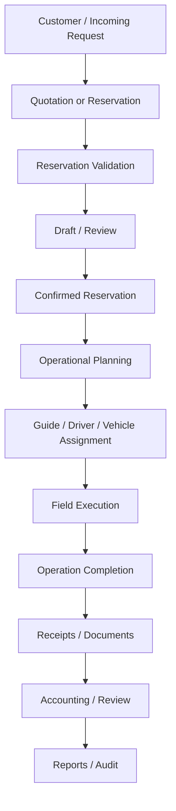
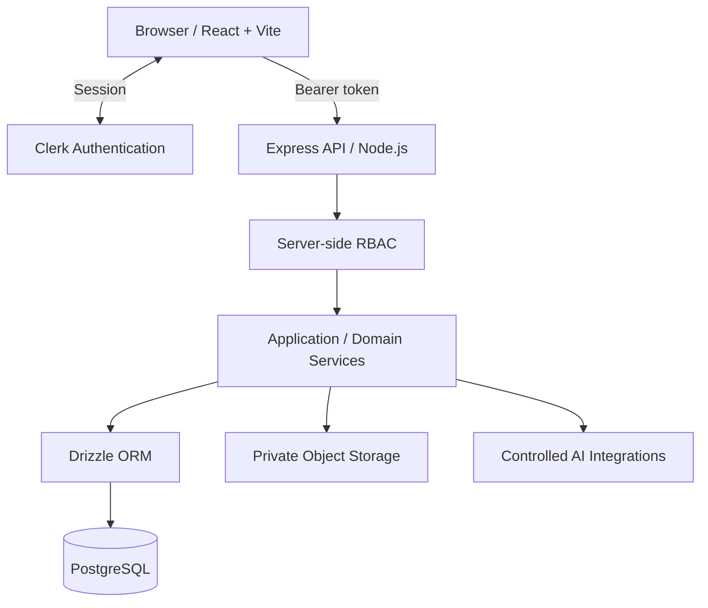

# TourPilot

**Travel agency operations management — from customer inquiry to accounting close.**

> **Current target:** September 2026 pilot release  
> **Status:** Active development — core reservation and operation foundations are working and the platform is being stabilized for real field and operations testing.

<p align="center">
  
</p>

<p align="center">
  
  
  
  
  
  
  
  
  
  
  
  
  
  
</p>

TourPilot is a full-stack, role-aware travel agency operations platform. It is designed to consolidate the end-to-end agency lifecycle — CRM, requests, quotations, reservations, tour planning, guide and driver assignment, field operations, cruise workflows, documents, accounting, reporting, audit and future AI-assisted execution — into one operational system of record.

The goal is not simply to replace spreadsheets with screens. TourPilot is intended to replace fragmented spreadsheets, messaging, manual reservation tracking and disconnected operational workflows with a controlled platform in which every important operation has a canonical record, every role sees the information it needs, and critical changes are permissioned, traceable and recoverable.

---

## Overview

Travel agencies typically operate across several teams — reservations and sales, operations, field personnel and guides, accounting and management — while important information is distributed across spreadsheets, WhatsApp, email, PDFs and separate systems.

TourPilot brings those workflows together.

A customer request can become a quotation or reservation; the reservation becomes an operational record; the operation receives guide, driver, vehicle and other assignments; field personnel execute the service; operational expenses and documents flow into accounting; and management receives a consistent operational and financial view.

The intended lifecycle is:

```text
Inquiry / Request
        ↓
Customer / CRM
        ↓
Quotation / Reservation
        ↓
Reservation Intake & Validation
        ↓
Operational Planning
        ↓
Guide / Driver / Vehicle Assignment
        ↓
Field Execution
        ↓
Operation Completion
        ↓
Accounting / Reporting / Audit
```

### Problems TourPilot addresses

- Fragmented customer, reservation, supplier and tour information across disconnected tools.
- Manual and error-prone reservation and quotation workflows.
- Spreadsheet-based operation planning that is difficult to validate and audit.
- Duplicate reservations created by repeated imports or manual entry.
- No canonical view of guide, driver and field assignments.
- Operational changes communicated through messages without a reliable system record.
- Accounting teams working from receipts, PDFs and attachments without a structured approval workflow.
- Difficulty querying historical operational and financial data.
- Sensitive business data being visible to users who do not need it.
- Historical data imports that can silently create duplicates or overwrite important information.
- Lack of a safe foundation for future ML models and AI agents.

---

## Product Goal

TourPilot is being built as the operational system of record for a travel agency.

The September 2026 objective is **not** to finish every possible feature. The objective is to reach a reliable pilot where the real operations team can use TourPilot for live reservations and daily operations without falling back to disconnected manual processes for the core flow.

The platform should eventually support the complete chain from the first customer interaction to accounting close, while preserving the operational history required for reporting, optimization and future intelligent automation.

---

## Key Features

### CRM

- Customer management with contact details and operational history.
- Supplier management with service categorization.
- Archive / restore patterns instead of destructive deletion where appropriate.
- Links between customers, quotations, reservations and operations.

### Sales & Requests

- New request intake.
- Customer-linked quotation management.
- Quotation lifecycle and pricing.
- Reusable tour catalogue.
- Tour and supplier cost relationships.
- Communication and follow-up support.

### Reservations

- Incoming reservation processing.
- Normalization before persistence.
- Draft-first processing for controlled review.
- Duplicate detection and idempotent import behavior.
- Human review for ambiguous or high-risk cases.
- Controlled confirmation into the operational flow.
- Historical spreadsheet import with review-required classification.

### Operations

- Operation lifecycle from planning through completion.
- Canonical operation detail.
- Guide assignment.
- Driver assignment.
- Personnel and operational-resource relationships.
- Internal task tracking.
- Calendar and operations-center views.
- Role-specific field and guide views.
- Notifications for operational events and changes.

### Cruise Operations

- Cruise ship master data.
- Cruise-linked operational planning foundation.
- Structured ship identities rather than repeated free-text values.
- Foundation for future cruise schedules, arrival/departure context and operation matching.

### Accounting

- Income and expense transactions.
- Receipt management.
- Accounting documents and attachments.
- Review and approval workflow.
- Operation-linked financial records.
- PDF reporting.
- Excel exports.
- ZIP document exports.
- Accounting settings and agency information.

### AI-Assisted Features

Existing AI-related capabilities include accounting assistance and document/OCR workflows. The long-term architecture extends this toward a controlled AI Operations Agent that can observe, recommend and eventually execute approved low-risk actions through TourPilot's own application services.

### Administration

- Authentication through Clerk.
- Server-side role-based authorization.
- User management.
- Role management.
- Agency / accounting settings.
- System control.
- Audit logs.

---

## Current Platform Areas

The current product navigation is organized around the following operational areas:

1. Kontrol Paneli
2. Görevlerim
3. Yeni Talep
4. Müşteriler
5. İletişim
6. Gözlem İncelemesi
7. Sheet İçe Aktarım
8. Tedarikçiler
9. Turlar
10. Teklifler
11. Operasyon Planlama
12. Takvim
13. Gelen Rezervasyonlar
14. Operasyon Merkezi
15. Bildirimler
16. Ayarlar
17. Muhasebe
18. Muhasebe Ayarları
19. Kullanıcı Yönetimi
20. Rol Yönetimi
21. Sistem Kontrolü
22. Denetim Kayıtları

The exact menu and module boundaries can continue to evolve. The September pilot scope is governed by the end-to-end operation lifecycle, not by the number of visible modules.

---

## Product Workflow



For imported reservations, replay safety and duplicate prevention are part of the workflow rather than optional cleanup steps.

---

## Architecture



### Key design decisions

- Frontend and API are separate artifacts inside a pnpm monorepo.
- API contracts are driven through OpenAPI and typed clients / schemas.
- Authentication does not replace authorization; protected actions require server-side permission enforcement.
- Business rules belong in controlled application/domain services, not UI-only logic.
- Database migrations must preserve existing operational data unless a destructive change is explicitly reviewed and approved.
- Replayed imports and retryable write operations must be idempotent where possible.
- Duplicate prevention is a first-class domain requirement.
- Staging and production remain separate environments.
- High-risk actions require human approval.
- Important mutations should be auditable.
- AI cannot bypass TourPilot permissions, validation, business rules or audit.

---

## Engineering Principles

TourPilot follows a **Kaizen + Clean Code** engineering approach. Reliability and maintainability take priority over short-term feature volume.

Non-negotiable rules:

- Server-side RBAC for protected actions.
- Destructive database migrations are prohibited unless explicitly reviewed and approved.
- Imports and write operations must be idempotent where replay is possible.
- Duplicate prevention is a first-class requirement.
- Staging and production must remain clearly separated.
- High-risk actions require human-in-the-loop approval.
- Important mutations must be observable and auditable.
- Historical data must not be silently changed or discarded.
- Business rules belong in controlled application services, not in UI-only logic.
- AI must never bypass TourPilot permissions, validation, audit or domain rules.
- Failures should be visible and recoverable rather than silent.
- Changes should be incremental, testable and reversible whenever practical.

---

## Reservation Processing Core

The main reservation intake flow has been implemented through the early milestones and manually verified through the draft-to-confirmation path.

```text
Incoming reservation
    → parse / normalize
    → duplicate / replay checks
    → create draft
    → human review when required
    → confirm
    → Incoming Reservations
    → operational flow
```

The architecture favors controlled confirmation rather than direct uncontrolled writes.

Important reservation principles:

- normalize before persistence;
- preserve source identity where possible;
- do not guess ambiguous mappings;
- flag uncertain records for review;
- make repeated import safe;
- prevent a retry from silently creating another reservation;
- preserve historical context when correcting data.

---

## Historical / Sheet Import

Historical data remediation and spreadsheet import work is treated as a controlled data-engineering workflow rather than a one-time bulk insert.

Established principles include:

- normalize before importing;
- preserve ambiguous cases for review instead of guessing;
- prevent repeated imports from creating duplicate records;
- retain exceptional historical cases as `REVIEW_REQUIRED` when confidence is insufficient;
- use staging before production execution;
- prove idempotency before large production batches.

Historical cleanup has included:

- operator normalization;
- guide ambiguity reduction;
- cancellation / rebooking handling;
- secondary-cell mapping;
- total-row classification;
- review-required classification;
- canonical operator naming such as `BTT/BESTT → BEST TURKEY TOUR`.

The import pipeline is expected to remain replay-safe as historical datasets grow.

---

## Cruise Master Data

Cruise-related master data is separated from reservation logic so cruise resources and operational usage can evolve safely.

Known ship resources include:

- CELESTYAL JOURNEY
- AZAMARA ONWARD
- CELEBRITY ASCENT
- MSC FANTASIA
- NORWEGIAN VIVA
- OOSTERDAM
- QUEEN VICTORIA
- SEABOURN QUEST
- SILVER NOVA

The cruise foundation is intended to support future schedule imports, port-day context and reservation / operation matching without relying on inconsistent free-text ship names.

---

## Personnel, Guides & Drivers

Guide, driver and personnel identity are being moved toward reusable canonical operational master data rather than free-text values copied independently into reservations and operations.

The long-term objective is consistent identity across reservation imports, operation assignments, field views, guide views, mobile views, performance records, accounting relationships where relevant and future recommendation models.

This also reduces ambiguity when historical spreadsheets use spelling variations or shortened names.

---

## Canonical Operation Detail

Operation detail is being refactored toward a canonical reservation / operation domain rather than duplicating business logic independently across admin, guide and field views.

> **One operational truth, multiple role-specific views.**

Admin, operations, guide and field users may see different information and controls, but they should not maintain competing copies of the same operation state.

---

## Accounting Module

TourPilot includes a structured accounting foundation tied to the operational lifecycle.

Accounting covers transactions, receipts, operation-linked records, accounting documents, review workflows, PDF reports, Excel exports and document ZIP archives.

Document review states can include:

```text
pending → approved | rejected | needs_info
```

Review actions should retain reviewer identity, timestamps and explanatory notes where appropriate.

---

## AI Features — Existing Foundation

TourPilot already contains AI-assisted concepts such as accounting summaries and OCR/document extraction. These capabilities are deliberately treated as assistance around deterministic application logic rather than unrestricted autonomous control.

AI integrations should fail safely. The operational platform must continue functioning when an external model is unavailable.

---

## AI Strategy — Phase 0: AI-Ready Foundation

TourPilot will eventually support a controlled **AI Operations Agent**, not only a passive observer.

```text
ML models        → prediction / scoring
LLM              → reasoning / explanation
AI Agent         → controlled actions
TourPilot        → permissions, rules, validation, audit and source of truth
```

The AI must never receive unrestricted database access or raw SQL execution capability.

### AI action levels

```text
L0 — Observe
L1 — Recommend
L2 — Act with approval
L3 — Autonomous low-risk action
```

Future AI actions must go through explicit TourPilot application actions, for example:

```text
reservation.createDraft
reservation.flagDuplicate
operation.createTask
operation.flagRisk
guide.recommend
guide.assign
driver.recommend
driver.assign
notification.send
```

Each action should define required permission, risk level, approval requirement, idempotency behavior, audit requirement and allowed input schema.

### Event / training data foundation

The platform should increasingly record reliable operational events such as:

```text
reservation.created
reservation.updated
guide.assigned
guide.reassigned
driver.assigned
operation.started
operation.completed
operation.delayed
reservation.cancelled
customer.complaint
```

The immediate goal is **to preserve good data**, not to delay the September pilot by training a custom model now.

### Explicitly outside AI Phase 0

- custom model training;
- GPU infrastructure;
- dedicated Python ML serving stack;
- fine-tuning;
- autonomous high-risk agents;
- large vector/RAG infrastructure;
- complex AI dashboards.

> **AI foundation now; custom ML and autonomous agent behavior after the core operational platform is stable.**

---

## Future AI / ML Models

Potential focused models include:

- Guide Match Score
- Driver / Vehicle Recommendation
- No-show Risk
- Cancellation Probability
- Operational Risk Score
- Pickup-time Prediction
- Tour-duration Prediction
- Reservation Anomaly Detection

Structured operational problems may initially be better suited to tabular models such as LightGBM or XGBoost than to a large language model.

---

## Security

### Authentication

TourPilot uses Clerk for authentication. Protected API requests use authenticated session/JWT context.

### Authorization & RBAC

Authorization is enforced server-side. UI visibility is useful for user experience but is not considered a security boundary. Role and permission checks protect operational, administrative and accounting actions.

### Data Isolation

Role-specific views should return only the operational data required by that role. Guide and field views must not become alternate unrestricted paths into customer, accounting or administrative data.

### Private Documents

Sensitive documents should remain private-by-default and be delivered only after authorization checks.

### AI Safety Boundary

AI-triggered mutations must travel through the same domain services, permissions, validation, approval and audit boundaries as human-triggered mutations.

---

## Technology Stack

| Layer | Technology | Purpose |
|---|---|---|
| Frontend | React + TypeScript | Role-aware web application |
| Router | Wouter | Client routing |
| Build | Vite | Frontend build and development |
| UI | shadcn/ui + Radix UI | Accessible UI primitives |
| Styling | Tailwind CSS | Application styling |
| Forms | React Hook Form + Zod | Form state and validation |
| Data | TanStack React Query | Client data fetching/cache |
| API contract | OpenAPI + Orval | Typed API contracts and generated clients |
| Backend | Express + TypeScript | REST API and application services |
| Runtime | Node.js | Server runtime |
| ORM | Drizzle ORM | Type-safe PostgreSQL access |
| Database | PostgreSQL | Operational source of truth |
| Authentication | Clerk | Identity/session management |
| AI | Controlled external model integrations | OCR, summaries and future agent reasoning |
| PDF | pdfmake / pdfkit | Business-document generation |
| Excel | ExcelJS | Structured exports |
| Archive | archiver | ZIP exports |
| Storage | Private object storage | Documents and attachments |
| Logging | pino / structured logging | Observability |
| Monorepo | pnpm workspaces | Shared frontend/backend libraries |
| Deployment | Render | Application hosting / staging |

The technical stack may evolve. Domain integrity, security, idempotency and audit rules take precedence over any individual framework.

---

## Repository Structure

```text
tourops-ai/
├── artifacts/
│   ├── tourops-ai/                  # React + Vite frontend
│   │   └── src/
│   │       ├── components/
│   │       ├── contexts/
│   │       ├── hooks/
│   │       ├── lib/
│   │       └── pages/
│   │
│   └── api-server/                  # Express backend
│       └── src/
│           ├── app.ts
│           ├── index.ts
│           ├── lib/
│           ├── middlewares/
│           └── routes/
│
├── lib/
│   ├── api-spec/                    # OpenAPI contract
│   ├── api-client-react/            # Generated React client/hooks
│   ├── api-zod/                     # Generated Zod schemas
│   └── db/                          # Drizzle schema and migrations
│
├── .env.example
├── pnpm-workspace.yaml
├── package.json
└── README.md
```

---

## Installation

### Prerequisites

- Node.js compatible with the current repository configuration
- pnpm
- PostgreSQL or the configured managed PostgreSQL environment
- Clerk application credentials
- Optional AI provider credentials for AI-assisted features

### Clone & install

```bash
git clone https://github.com/iglesiastourturkey/tourops-ai.git
cd tourops-ai
pnpm install
cp .env.example .env
```

Populate environment-specific values locally or through the deployment platform. Never commit production secrets.

Database changes must be handled through reviewed migrations. Historical and bulk-import migrations must be proven on staging before production.

---

## Environment & Deployment

TourPilot uses separate deployment environments. Staging is the proving ground for migrations, imports and risky operational changes.

Current staging deployment:

```text
https://tourops-ai-staging.onrender.com
```

Deployment principles include staging before production, environment-specific secrets, health checks, migration verification, bulk-operation proof, recovery planning and no silent schema mutation.

---

## Repository / Branch Strategy

Major changes are developed through focused branches rather than mixing unrelated work into one long-running branch.

Before merging a phase:

1. validate the business rule;
2. verify migrations are non-destructive;
3. test replay / idempotency where relevant;
4. verify role isolation;
5. run staging acceptance;
6. document unresolved review-required cases;
7. only then promote toward production.

### Branch naming

```text
feature/short-description
fix/short-description
chore/short-description
```

### Commit style

```text
feat(accounting): add document export
fix(auth): enforce server-side permission check
docs: update TourPilot roadmap
```

---

## Development Quality Gates

Before a significant change is considered complete, verify the relevant subset of frontend/backend typechecks, production build, automated tests, API contract consistency, migration safety, role/permission isolation, duplicate/replay behavior, staging acceptance, secret safety and documentation consistency.

New AI features must include safe failure behavior and must not make core operations dependent on model availability unless explicitly designed that way.

---

## Current Development Direction — September 2026

Priority order for the September pilot:

1. Reservation correctness and duplicate safety.
2. Canonical operation-detail domain.
3. Guide / driver / personnel assignment correctness.
4. Field and guide role views.
5. Calendar and operations-center reliability.
6. Historical / spreadsheet import safety.
7. RBAC, audit and mutation safety.
8. Pilot-readiness testing with real operational scenarios.

Nice-to-have features must not displace these priorities before the pilot.

---

## September Scope Rule

| Classification | Meaning |
|---|---|
| **NOW / SEPTEMBER** | Required for the real pilot or to prevent operational failure |
| **FOUNDATION** | Small architectural work needed now to avoid expensive rework later |
| **POST-LAUNCH** | Valuable, but not necessary for the September pilot |
| **BACKLOG** | Future improvement, experiment or convenience feature |

A new idea enters the September scope only if it is required for a real operation to complete safely, prevents material data/security/operational risk, or avoiding it now would force a major architectural rewrite later.

---

## Pilot Definition of Done

The September pilot is ready when the team can complete real operational scenarios end to end with acceptable reliability:

- reservations can be created or imported safely;
- duplicates are controlled;
- reservations become operations correctly;
- guide / driver / personnel can be assigned from canonical data;
- operation details are consistent across relevant roles;
- field / guide users see correctly scoped data;
- calendar and operations center show reliable operational state;
- critical changes are protected by permissions and auditability;
- historical import does not corrupt current operations;
- staging proves migrations and bulk changes before production;
- failures are visible and recoverable rather than silent.

---

<!-- RECENT_DEVELOPMENTS:START -->

## Recent Developments

> Automatically generated from recent commits on `main`. Keep product overview, architecture and roadmap sections curated by humans.

### Features
- split cruise and sejour operation subdomains end to end — `e2788f1` (2026-09-10)
- split cruise and sejour operation experiences — `a35ef5a` (2026-09-10)
- add historical operation domain correction foundation — `c129d4e` (2026-09-10)
- add idempotent guard migration for historical promoted-hash check — `477e722` (2026-09-10)
- add controlled exact-recovery correction CLI — `802b4f9` (2026-09-09)
- add staging db execution adapter — `e954ff3` (2026-09-09)
- add staging execution approval foundation — `f04da17` (2026-09-09)
- add master import dry-run foundation — `12a7a48` (2026-09-09)

### Fixes
- harden historical pickup normalization CAS and versioning — `75ef39d` (2026-09-11)
- refresh approved staging plan digest — `e30e505` (2026-09-09)

### Tests
- scope 2D.2 migration guard to its own phase + allowlist 0026 — `ed1a3c9` (2026-09-10)

### Documentation
- restore README badges, license and project signature — `87f85e3` (2026-09-10)
- restore comprehensive README and layer current roadmap updates — `64c9391` (2026-09-10)
- refresh TourPilot status and AI-ready roadmap — `79ba65b` (2026-09-10)

### Build & CI
- automate TourPilot README development updates — `ecccd68` (2026-09-10)

### Maintenance
- add automatic README development log generator — `be03336` (2026-09-10)
- add AI efficiency and agent orchestration standard (#54) — `2fc9ec8` (2026-09-09)
- establish long-term engineering quality standard — `7b96484` (2026-09-08)

<!-- RECENT_DEVELOPMENTS:END -->

---

## Roadmap

### Existing / Established Foundations

- [x] Role-aware application architecture
- [x] CRM foundation — customers and suppliers
- [x] Tours and quotations foundation
- [x] Operations lifecycle foundation
- [x] Guide / driver assignment foundation
- [x] Notification foundation
- [x] Accounting transaction and document foundation
- [x] Reporting / export foundation
- [x] Clerk authentication
- [x] AI-assisted accounting / OCR concepts
- [x] Reservation-processing milestones through draft / confirmation flow
- [x] Historical import remediation foundation
- [x] Cruise master-data foundation
- [x] Staging deployment foundation

### September Pilot Focus

- [ ] Complete canonical operation-detail rollout
- [ ] Finish reservation-domain hardening
- [ ] Prove import idempotency on staging datasets
- [ ] Complete guide / driver / personnel canonicalization required for operations
- [ ] Validate field and guide role views against real scenarios
- [ ] Validate calendar / operations center consistency
- [ ] Complete RBAC and mutation-safety checks for pilot-critical paths
- [ ] Run end-to-end operational pilot scenarios
- [ ] Lock TourPilot Master Plan v1 for remaining September work

### Post-Launch / Expansion

- [ ] TourPilot Mobile / PWA integration
- [ ] Deeper executive analytics
- [ ] Sales conversion analytics
- [ ] Expanded calendar integrations
- [ ] Customer-facing portal capabilities
- [ ] Advanced cruise scheduling automation
- [ ] Focused ML recommendation/risk models
- [ ] Controlled AI Operations Agent progression from L0 → L3
- [ ] Multi-company / multi-tenant capabilities if required by product direction

---

## Contributing

TourPilot is under active development. Contributors should preserve the platform's domain and safety guarantees rather than optimizing only for short-term code completion.

Before opening or merging a change, keep changes scoped, avoid unrelated refactors, preserve backwards compatibility where practical, do not introduce destructive migrations casually, keep protected behavior server-authorized, update validation/tests for changed business rules and update this README when architecture or workflows change.

---

## License

**Proprietary Software — All Rights Reserved.**

Copyright © 2026 TourPilot / Iglesias Tour Turkey.

This repository and its source code are proprietary. Unauthorized copying, modification, distribution, publication, sublicensing, commercial use or reuse of this software, in whole or in part, is prohibited unless explicit written permission has been granted by the repository owner.

Access to the source code does not grant a license to use, reproduce or distribute the software.

---

## Core Principle

> **Ship a reliable operational core first. Preserve the data and architecture needed for intelligence. Add autonomy only after TourPilot can safely control it.**

TourPilot should become a system the operations team can trust first, a system management can learn from second, and an intelligent execution platform third.

---

<p align="center">
  <strong>TourPilot</strong><br />
  Built for modern travel agency operations.<br /><br />
  <strong>Designed & Developed by Mehmet Cam</strong><br />
  Iglesias Tour Turkey · 2026
</p>
